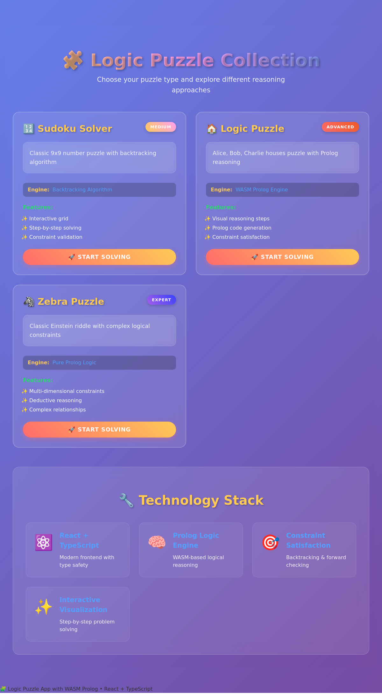

# 🧩 Prolog Logic Puzzle Solver

A React TypeScript application that demonstrates logic puzzle solving using Tau Prolog and WebAssembly. This interactive educational tool allows users to explore constraint satisfaction problems through step-by-step Prolog reasoning.



## 🚀 Features

- **5 Logic Puzzles**: Diverse constraint satisfaction problems including houses, school clubs, fruit market, office workers, and restaurant menus
- **Interactive Solver**: Step-by-step visualization of Prolog reasoning process
- **WASM Performance**: Uses SWI-Prolog WebAssembly for fast constraint solving
- **Educational Interface**: Shows logical deduction steps and constraint application
- **Systematic Format**: Consistent puzzle structure for easy expansion and mass production

## 🎯 Puzzle Types

1. **Houses Puzzle** - Classic neighbor constraints with property assignments
2. **School Clubs** - Membership rules and activity scheduling logic
3. **Fruit Market** - Pricing and inventory constraint solving
4. **Office Workers** - Desk assignments with department rules
5. **Restaurant Menu** - Dietary restrictions and pricing logic

## 🛠 Tech Stack

- **Frontend**: React 19 with TypeScript
- **Logic Engine**: Tau Prolog (SWI-Prolog WASM)
- **Build Tool**: Vite 4.5.14
- **Styling**: CSS with custom variables
- **Package Manager**: npm

## 📦 Installation

```bash
# Clone the repository
git clone https://github.com/yuis-ice/prolog-logic-puzzle-solver.git
cd prolog-logic-puzzle-solver

# Install dependencies
npm install

# Start development server
npm run dev
```

## 🎮 Usage

1. **Select a Puzzle**: Choose from 5 different logic puzzles
2. **Review Constraints**: Read the problem description and constraints
3. **Enable Visualization**: Toggle step-by-step reasoning to see Prolog in action
4. **Solve**: Click "Solve with Prolog" to see the solution process
5. **Explore**: Try different puzzles to understand various constraint patterns

## 🏗 Project Structure

```
src/
├── components/
│   ├── LogicPuzzleSolver.tsx    # Main puzzle interface
│   └── LogicPuzzleSolver.css    # Styling for puzzle components
├── data/
│   └── puzzleDatabase.ts        # Systematic puzzle definitions
├── hooks/
│   └── usePrologEngine.ts       # Prolog WASM integration
└── App.tsx                      # Application entry point
```

## 🧠 How It Works

1. **Puzzle Definition**: Each puzzle follows a systematic `PuzzleProblem` interface with variables, constraints, and Prolog code
2. **Constraint Processing**: Prolog rules define logical relationships and constraints
3. **Solution Search**: Backtracking algorithm explores the solution space
4. **Visualization**: Step-by-step display shows the reasoning process

## 🔧 Development

```bash
# Development server
npm run dev

# Type checking
npm run lint

# Build for production
npm run build

# Preview production build
npm run preview
```

## 📝 Adding New Puzzles

The project uses a systematic format for easy puzzle creation:

```typescript
{
  id: 'puzzle_id',
  title: 'Puzzle Title',
  description: 'Problem description with entities and attributes',
  constraints: ['List of constraint rules'],
  variables: {
    people: ['entity1', 'entity2'],
    attributes: {
      attribute1: ['value1', 'value2'],
      attribute2: ['value3', 'value4']
    }
  },
  prologCode: 'Prolog constraint satisfaction code',
  solution: [/* Expected solution array */],
  difficulty: 'easy' | 'medium' | 'hard'
}
```

## 🤝 Contributing

Contributions are welcome! Please read our [Contributing Guidelines](CONTRIBUTING.md) for details on how to submit pull requests, report issues, and contribute to the project.

## 📄 License

This project is licensed under the MIT License - see the [LICENSE](LICENSE) file for details.

## 🔗 Links

- **Demo**: [Live Demo](https://yuis-ice.github.io/prolog-logic-puzzle-solver)
- **Repository**: [GitHub](https://github.com/yuis-ice/prolog-logic-puzzle-solver)
- **Issues**: [Bug Reports & Feature Requests](https://github.com/yuis-ice/prolog-logic-puzzle-solver/issues)

## 🏆 Acknowledgments

- [SWI-Prolog](https://www.swi-prolog.org/) for the Prolog engine
- [Tau Prolog](http://tau-prolog.org/) for JavaScript/WASM integration
- [React](https://react.dev/) for the UI framework
- [Vite](https://vitejs.dev/) for the build tooling

---

Built with ❤️ by [.fumiya.tsx](https://github.com/yuis-ice)

## 実装済み機能

### 数独ソルバー
- 9x9の数独グリッドでパズルを作成・編集
- バックトラッキングアルゴリズムによる制約充足問題の解決
- リアルタイムでの解答表示
- パズルのリセット・クリア機能

## 今後の実装予定

- Nクイーン問題ソルバー
- ゼブラパズル（論理推論パズル）
- カスタムパズル作成機能
- より高度なProlog制約ソルバー

## 技術スタック

- **フロントエンド**: React 19, TypeScript
- **ビルドツール**: Vite
- **アルゴリズム**: バックトラッキング（数独解法）
- **スタイリング**: CSS3 (グラデーション、ガラスモーフィズム)
- **型システム**: TypeScript (厳格型チェック)
- **テスト・デバッグ**: Playwright

## 開発・実行

### 前提条件
- Node.js (v20以上推奨)
- npm または yarn

### インストール
```bash
npm install
```

### 開発サーバー起動
```bash
npm run dev
```

### プロダクションビルド
```bash
npm run build
```

### リント実行
```bash
npm run lint
```

## プロジェクト構造

```
src/
├── components/          # Reactコンポーネント
│   ├── SudokuSolver.tsx    # 数独ソルバー
│   ├── LogicPuzzleSelector.tsx  # パズル選択
│   └── *.css              # コンポーネント別スタイル
├── hooks/               # カスタムフック
│   └── usePrologEngine.ts  # Prolog統合
├── types/               # TypeScript型定義
│   └── tau-prolog.d.ts     # Tau Prologの型
├── App.tsx              # メインアプリケーション
└── main.tsx             # エントリーポイント
```

## Tau Prolog について

Tau PrologはJavaScriptで実装されたProlog処理系で、以下の特徴があります：

- **Webブラウザ完全対応**: Node.jsとブラウザの両方で動作
- **ECMAScript標準準拠**: モダンなJavaScript環境で動作
- **制約充足問題**: 論理パズルや最適化問題に最適
- **高性能**: WebAssemblyとの組み合わせで高速処理

## ライセンス

MIT License
